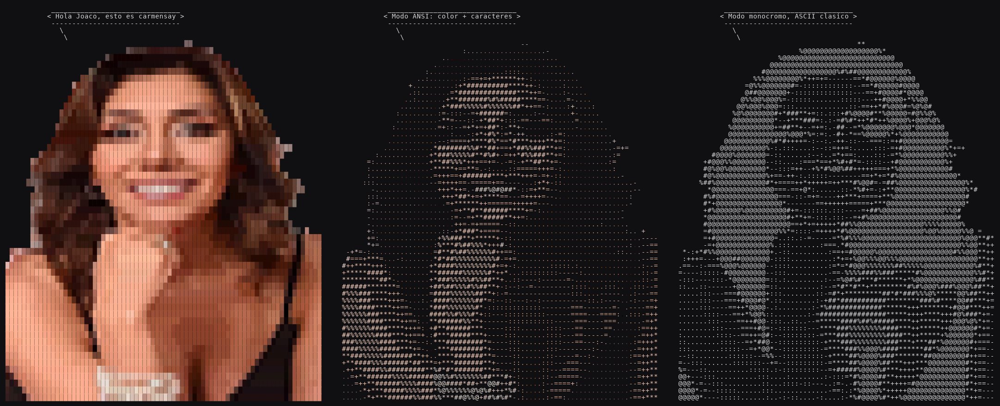

# carmensay

Like `cowsay`, but with Carmen Gloria. A zero-dependency Python script that
prints a speech bubble over an ASCII portrait.



## Usage

```bash
python3 carmensay.py "Hello, good afternoon"
echo "text from a pipe" | python3 carmensay.py
git log -1 --format=%s | python3 carmensay.py -s
```

## Options

| Flag | What it does |
|---|---|
| `-s`, `--small` | compact portrait, 40 columns |
| `-b`, `--big` | detailed portrait, 76 columns |
| `-c`, `--color` | blocks + truecolor: almost the photo |
| `-a`, `--ansi` | ASCII chars + truecolor |
| `-n`, `--no-color` | monochrome, classic ASCII |
| `-t`, `--think` | thought bubble |
| `-W N` | text width (default 40) |
| `--plain` | portrait only, no bubble |

Without flags it auto-detects: color with blocks if output is a compatible
terminal, monochrome if redirected to a file or pipe. Respects `NO_COLOR`. Size
adapts to terminal width (compact below 80 columns).

The `-c` mode needs a truecolor (24-bit) terminal: iTerm2, Kitty, Alacritty,
WezTerm, GNOME Terminal, Windows Terminal. If it looks off, use `-a` instead.

## Install as a command

```bash
mkdir -p ~/.local/bin
ln -sf "$PWD/carmensay.py" ~/.local/bin/carmensay
# make sure ~/.local/bin is in your PATH
carmensay "it works"
```

### Compile to standalone binary

You can build a self-contained binary with PyInstaller:

```bash
pip install pyinstaller
pyinstaller --onefile --add-data "carmen_gloria.blob:." carmensay.py
```

The binary lands in `dist/carmensay`. Copy it to any `PATH` folder — no Python,
Pillow, or standalone blob needed.

```bash
sudo cp dist/carmensay /usr/local/bin/
carmensay "Hello from a binary"
```

The code uses `sys._MEIPASS` to find the blob inside the bundle, falling back to
the loose file in the script's directory during development.

To greet you on terminal start, add to `~/.bashrc` or `~/.zshrc`:

```bash
carmensay -s "Good morning, $USER"
```

## Changing the photo

`regenerate.py` rebuilds the art embedded inside `carmensay.py`. It needs
`pillow` and `numpy`.

```bash
pip install pillow numpy
python3 regenerate.py another_photo.png --crop 545 60 880 560
```

Works best with a transparent-background PNG: the alpha channel is used to
cut out the silhouette. `--no-crop` takes the full image; `--big` and
`--small` change the column width of each version.

## Generating the preview

```bash
pip install pillow
python3 generate_preview.py
```

## Files

- `carmensay.py` — the script (art included, no dependencies)
- `regenerate.py` — regenerates the art from another image
- `generate_preview.py` — renders the three modes side by side into a PNG
- `carmen-gloria-ascii-76col.txt` / `-40col.txt` — plain-text portrait
- `carmensay-preview.png` — the three modes side by side
