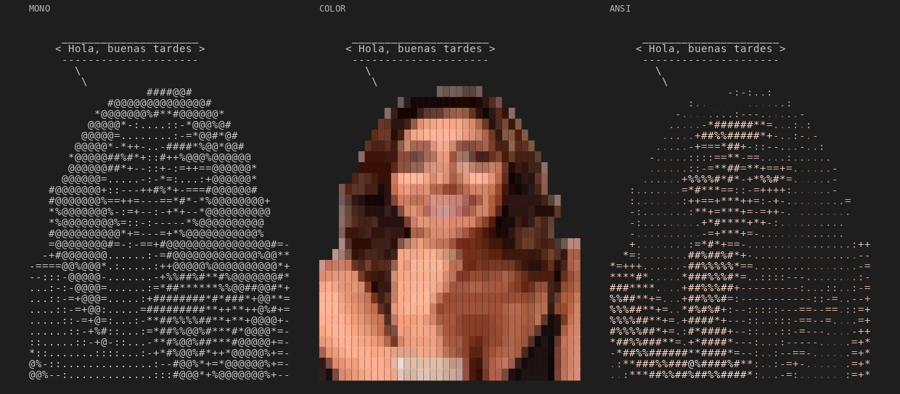

# whosay

Like `cowsay`, but with a cast of characters — Carmen Gloria Arroyo is the
default and most iconic one, but not the only one possible. A zero-dependency
Python script that prints a speech bubble over an ASCII portrait.



## Usage

```bash
python3 whosay.py "Hello, good afternoon"
echo "text from a pipe" | python3 whosay.py
git log -1 --format=%s | python3 whosay.py -m
python3 whosay.py -C some_other_character "hi"
python3 whosay.py --list-characters
```

## Options

| Flag | What it does |
|---|---|
| `-C`, `--character NAME` | which character to draw (default `carmen_gloria`) |
| `--list-characters` | list the available characters and exit |
| `-s`, `--small` | small portrait, 20 columns (default) |
| `-m`, `--medium` | medium portrait, 40 columns |
| `-c`, `--color` | blocks + truecolor: almost the photo |
| `-a`, `--ansi` | ASCII chars + truecolor |
| `-n`, `--no-color` | monochrome, classic ASCII |
| `-t`, `--think` | thought bubble |
| `-W N` | text width (default 40) |
| `--plain` | portrait only, no bubble |

Without flags it auto-detects: color with blocks if output is a compatible
terminal, monochrome if redirected to a file or pipe. Respects `NO_COLOR`.

The `-c` mode needs a truecolor (24-bit) terminal: iTerm2, Kitty, Alacritty,
WezTerm, GNOME Terminal, Windows Terminal. If it looks off, use `-a` instead.

## Install as a command

```bash
mkdir -p ~/.local/bin
ln -sf "$PWD/whosay.py" ~/.local/bin/whosay
# make sure ~/.local/bin is in your PATH
whosay "it works"
```

`whonews.py` is a separate, stdlib-only script — it's not bundled into the
`whosay` binary or symlink above. Link it the same way:

```bash
ln -sf "$PWD/whonews.py" ~/.local/bin/whonews
whonews "it works"
```

It has to keep living next to the repo either way: it does `import whosay`
and reads `characters/` straight off disk, so the symlink only works while
the checkout stays in place.

### Compile to standalone binary

You can build a self-contained binary with PyInstaller:

```bash
pip install pyinstaller
pyinstaller --onefile --add-data "characters:characters" whosay.py
```

The binary lands in `dist/whosay`. Copy it to any `PATH` folder — no Python,
Pillow, or loose character files needed.

```bash
sudo cp dist/whosay /usr/local/bin/
whosay "Hello from a binary"
```

Or, without root, drop it in `~/.local/bin`:

```bash
cp dist/whosay ~/.local/bin/whosay
whosay "Hello from a binary"
```

The code uses `sys._MEIPASS` to find `characters/` inside the bundle, falling
back to the loose directory next to the script during development.

This only builds `whosay`. `whonews.py` isn't bundled in — compile it the
same way if you want a standalone `whonews` binary too:

```bash
pyinstaller --onefile --add-data "characters:characters" whonews.py
```

To greet you on terminal start, add to `~/.bashrc` or `~/.zshrc`:

```bash
whosay -m "Good morning, $USER"
```

## The news anchor: `whonews.py`

Pulls the day's top stories from Google News RSS and, half the time, asks a
local model through [Ollama](https://ollama.com) for a one-line take — in a
character's voice — about one of them picked at random. The other half, it
skips the news and the character just cracks a sarcastic joke instead. Either
way, prints one panel through `whosay`. Stdlib only — no extra dependencies.

```bash
ollama serve &            # if it isn't already running
python3 whonews.py        # one random take, Chile
```

```
UDI advierte al INDH con "consecuencias" por eventual visita a reos de cárcel de Talca (BioBioChile)
   __________________________________________
  / El miedo institucional es el mejor       \
  | aliado de un régimen que niega la verdad |
  \ y la justicia.                           /
   ------------------------------------------
     \
      \
   ...
```

or, the other half of the time, no headline at all:

```
Carmen Gloria improvisa:
   __________________________________________
  / ¿Sabes por qué Chile está tan            \
  | emocionado? Porque finalmente            |
  | encontraron un acuerdo... que nadie va a |
  \ cumplir.                                 /
   ------------------------------------------
     \
      \
   ...
```

| Flag | What it does |
|---|---|
| `-n N` | pool size to pick a headline from at random (default 5) |
| `-C`, `--character NAME` | which character comments (default `carmen_gloria`) |
| `--topic NAME` | Google News section: `world`, `nation`, `business`, `technology`, `science`, `sports`, `entertainment`, `health` |
| `--query TEXT` | search a term instead of browsing a section |
| `--region CODE` / `--lang CODE` | Google News country and language (default `CL`, `es-419`) |
| `--model NAME` | Ollama model (default `gemma3:4b`) |
| `--headlines` | skip the model, just print one random headline |
| `--timeout SEC` | model timeout (default 120) |
| `--refresh` | ignore the cache: re-fetch the feed and re-ask the model |
| `--no-cache` | don't read or write the cache at all |
| `--ttl MIN` | how long a cached feed stays fresh (default 15) |
| `--db PATH` | cache location |
| `--history [N]` | print the last N archived takes for the selected character (default 10) and exit |
| `--prune DAYS` | drop takes older than DAYS (default 365, `0` keeps everything) |

It also takes the `whosay` look flags: `-s`/`-m`, `-c`/`-a`/`--no-color`, `-W`.

Defaults can come from the environment: `WHONEWS_MODEL`, `WHONEWS_REGION`,
`WHONEWS_LANG`, `WHONEWS_DB`, plus `OLLAMA_HOST` if your daemon isn't on
`127.0.0.1:11434`.

```bash
WHONEWS_MODEL=gemma3:4b python3 whonews.py -n 3 --topic technology
python3 whonews.py --query "arte contemporáneo" --region AR --lang es-419
python3 whonews.py -C some_other_character
```

Reasoning-capable models are asked with `think: false` — otherwise they spend
the whole token budget thinking and hand back an empty answer.

### The cache

Feeds and opinions live in a SQLite file at `~/.cache/whosay/news.db`
(`$XDG_CACHE_HOME` is honored). Two tables:

- `feeds` — the raw RSS body per URL, reused for `--ttl` minutes and pruned
  after a day. Keeps repeated runs from hammering Google. Shared by every
  character, since headlines don't depend on who's commenting on them.
- `takes` — one opinion per `(headline, model, character)`, kept for a year.
  This is where the real saving is: replaying a stored take costs
  milliseconds instead of a model call.

Pruning runs on every invocation, before anything else touches the cache, and
says on stderr how many rows it dropped. `--prune 0` turns it off and keeps the
archive forever; `--prune 30` trims it hard.

```bash
python3 whonews.py            # a few seconds the first time (if it picks news)
python3 whonews.py            # 0.15s, straight from SQLite
python3 whonews.py --refresh  # ask again, overwrite the stored take
python3 whonews.py --history  # the archive, oldest headlines and all
```

`--history` doubles as the conversation archive: every opinion a character has
given in the last year, with its headline and timestamp. If the cache file can't
be opened the tool says so on stderr and keeps working without it.

### Picking a model

The default is `gemma3:4b`, chosen for latency: this is a terminal toy, and it
has to answer at terminal speed. Measured on a modest GPU, three headlines each,
model unloaded first:

| Model | First call (loads into VRAM) | Per headline after that | Spread |
|---|---|---|---|
| `gemma3:4b` | 20.7 s | **3.9 s** | 3.7–4.1 s |
| `gemma4:latest` | 12.5 s | **35.4 s** | 12.5–44.9 s |

`gemma4` writes the sharper line, but it's a reasoning model: nine times slower
warm, and unpredictable — you can't tell whether a headline will take 12 seconds
or 45. `gemma3:4b` answers in the same four seconds every time, which is what
makes it usable while you wait at a prompt.

```bash
WHONEWS_MODEL=gemma4:latest python3 whonews.py   # when you're not in a hurry
```

Takes from both models coexist in the cache — the key is
`(headline, model, character)` — so switching doesn't throw away what you
already generated.

The opinions are generated by a language model as a parody. They are not quotes
from, or endorsed by, any real person.

## Characters

Everything that makes a character who they are lives under
`characters/<name>/`, not in the code:

```
characters/
  carmen_gloria/
    art.blob          # the ASCII portrait, all sizes and color modes
    character.json     # display_name, persona, joke_prompt, fallback
    photo.png           # (optional) the source photo art.blob was built from
```

`character.json` looks like this:

```json
{
  "display_name": "Carmen Gloria",
  "persona": "Eres Carmen Gloria: periodista y crítica cultural...",
  "joke_prompt": "Cuenta un chiste corto y sarcástico sobre...",
  "fallback": "Prefiero no comentar. Y eso ya es un comentario."
}
```

- `persona` — the system prompt that gives `whonews.py` its voice when
  commenting on a headline.
- `joke_prompt` — what's asked when the character skips the news for a
  standalone joke instead.
- `fallback` — printed if the model comes back with nothing to say.

`whosay --list-characters` lists every folder under `characters/` that has an
`art.blob`; both `whosay.py` and `whonews.py` take `-C`/`--character NAME` to
pick one (default `carmen_gloria`).

### Adding a character

1. Turn a photo into art with `regenerate.py` (needs `pillow` and `numpy`):

   ```bash
   pip install pillow numpy
   python3 regenerate.py my_photo.png --character nuevo_personaje --crop 545 60 880 560
   ```

   This writes `characters/nuevo_personaje/art.blob`. Works best with a
   transparent-background PNG: the alpha channel cuts out the silhouette. Use
   `--no-crop` for the full image, and `--medium`/`--small` to tweak the
   column width of each size.

2. Write `characters/nuevo_personaje/character.json` (see the format above).
   `whonews.py` will refuse to run against a character that's missing this
   file, and `whosay.py` will refuse one missing `art.blob`.

```bash
whosay -C nuevo_personaje "probando"
whonews -C nuevo_personaje
```

## Generating the preview

```bash
pip install pillow
python3 generate_preview.py
```

## Files

- `whosay.py` — the portrait/bubble renderer, character-agnostic (no dependencies)
- `whonews.py` — Google News + a local model, read out loud by a character
- `characters/` — one folder per character: art, persona, joke prompt
- `schema.sql` — the SQLite schema `whonews.py` caches into
- `regenerate.py` — regenerates a character's art from a photo
- `generate_preview.py` — renders the three color modes side by side into a PNG
- `whosay-preview.png` — the three modes side by side
