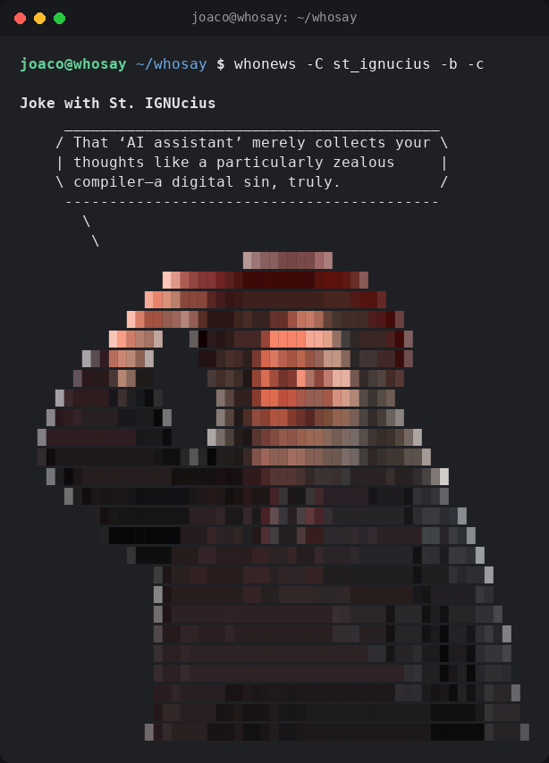

# whosay

Like `cowsay`, but with a cast of characters — Carmen Gloria Arroyo is the
most iconic one, but not the only one possible: every run picks a character at
random unless you name one. A zero-dependency Python script that prints a
speech bubble over an ASCII portrait.



## Usage

```bash
python3 whosay.py "Hello, good afternoon"
echo "text from a pipe" | python3 whosay.py
git log -1 --format=%s | python3 whosay.py -b
python3 whosay.py -C some_other_character "hi"   # always the same one
python3 whosay.py --list-characters
```

## Options

| Flag | What it does |
|---|---|
| `-C`, `--character NAME` | which character to draw (default: a random one) |
| `--list-characters` | list the available characters and exit |
| `--random` | pick a random character (the default) |
| `-s`, `--small` | small portrait, about 20 columns (default) |
| `-m`, `--medium` | medium portrait, about 40 columns |
| `-b`, `--big` | big portrait, about 60 columns |
| `-c`, `--color` | blocks + truecolor: almost the photo |
| `-a`, `--ansi` | ASCII chars + truecolor |
| `-n`, `--no-color` | monochrome, classic ASCII |
| `-t`, `--think` | thought bubble |
| `-W N` | text width (default 40) |
| `--plain` | portrait only, no bubble |
| `--version` | print the version and exit |

Without flags it auto-detects: color with blocks if output is a compatible
terminal, monochrome if redirected to a file or pipe. Respects `NO_COLOR`.

The column counts are what `regenerate.py` bakes into `art.blob` by
default, not a property of the flags. A character can be rendered at any
width, and a landscape subject needs more columns to stand as tall as a
face — `horseshoe_crab` is 28/48/68 for that reason.

The `-c` mode needs a truecolor (24-bit) terminal: iTerm2, Kitty, Alacritty,
WezTerm, GNOME Terminal, Windows Terminal. If it looks off, use `-a` instead.

## Install as a command

```bash
mkdir -p ~/.local/bin
ln -sf "$PWD/whosay.py" ~/.local/bin/whosay
# make sure ~/.local/bin is in your PATH
whosay "it works"
```

`whonews.py` is a separate, stdlib-only script — it's not bundled into the
`whosay` binary or symlink above. Link it the same way:

```bash
ln -sf "$PWD/whonews.py" ~/.local/bin/whonews
whonews "it works"
```

Both symlinks keep pointing at the checkout: each script does `import
whocast` (the module they share, see [Shared code](#shared-code-whocastpy))
and reads `characters/` straight off disk, so they only work while the
checkout stays in place. They find it through the symlink, not beside it —
the path is resolved with `realpath`, so `~/.local/bin` doesn't need a
`characters/` folder of its own.

### Compile to standalone binary

You can build a self-contained binary with PyInstaller:

```bash
pip install pyinstaller
./build.sh                  # both binaries, or one at a time:
pyinstaller --onefile --paths . --add-data "characters:characters" whosay.py
```

`--paths .` is what pulls `whocast.py` in: PyInstaller follows the import and
bundles the module into the binary, so the result doesn't need the checkout.
It lands in the generated `whosay.spec` / `whonews.spec` as `pathex=['.']` —
those are build artifacts, rewritten on every run and gitignored, so edit
`build.sh`, not them.

The binary lands in `dist/whosay`. Copy it to any `PATH` folder — no Python,
Pillow, or loose character files needed.

```bash
sudo cp dist/whosay /usr/local/bin/
whosay "Hello from a binary"
```

Or, without root, drop it in `~/.local/bin`:

```bash
cp dist/whosay ~/.local/bin/whosay
whosay "Hello from a binary"
```

The code uses `sys._MEIPASS` to find `characters/` inside the bundle, falling
back to the loose directory next to the script during development.

`build.sh` builds both. On its own, that first command only builds `whosay`
— `whonews.py` is a separate binary, compiled the same way:

```bash
pyinstaller --onefile --paths . --add-data "characters:characters" whonews.py
```

To greet you on terminal start, add to `~/.bashrc` or `~/.zshrc`:

```bash
whosay -m "Good morning, $USER"
```

## The news anchor: `whonews.py`

Pulls the day's top stories from Google News RSS and, 70% of the time by
default, asks a model for a one-line take — in a character's voice — about
one of them picked at random, on a local
[llama.cpp](https://github.com/ggml-org/llama.cpp) server unless you point it
somewhere else with `--provider`.
10% of the time it skips the news and the character just cracks a sarcastic
joke; 10% the character invents a brief anecdote in its own style, starring
itself alongside one other random character; and the remaining 10%, it
just drops its signature phrase. `--joke-chance`, `--anecdote-chance` and
`--signature-chance` change the split. Either way, prints one panel through
`whosay`. Stdlib only — no extra dependencies.

```bash
llama-server -m model.gguf --port 8080 &   # if it isn't already running
python3 whonews.py                          # a random character, in its own region
```

```
Noticias con Carmen Gloria
2026-08-14  UDI advierte al INDH con "consecuencias" por eventual visita a reos de cárcel de Talca (BioBioChile)
   __________________________________________
  / El miedo institucional es el mejor       \
  | aliado de un régimen que niega la verdad |
  \ y la justicia.                           /
   ------------------------------------------
     \
      \
   ...
```

or, the other 10% of the time, no headline at all:

```
Chiste con Carmen Gloria
   __________________________________________
  / ¿Sabes por qué Chile está tan            \
  | emocionado? Porque finalmente            |
  | encontraron un acuerdo... que nadie va a |
  \ cumplir.                                 /
   ------------------------------------------
     \
      \
   ...
```

and, the remaining 10% of the time, a brief anecdote in the character's own
style, starring itself and one other character picked at random:

```
Anécdota con Carmen Gloria
   __________________________________________
  / Estoy asustada ante las puertas de la    \
  | catedral de Salamanca, donde se iba a    |
  | reunir el congreso de teóricos           |
  | cristianos. Me sentí vencida ante el     |
  | pasado y su religión en lugar de poder   |
  | tomar mi lugar como una activista        |
  \ política en contra del imperialismo.     /
   ------------------------------------------
     \
      \
   ...
```

and the last 10%, the character just drops its signature phrase:

```
The catchphrase of Ozzy Osbourne
   _________
  < SHARON! >
   ---------
     \
      \
   ...
```

The header line and the date are printed bold/colored when the terminal
supports it. `--headlines` prints the same header + dated headline (no
opinion); `--history` prints the same dated headline per archived entry,
without the header. The header's language comes from the character's
`language` field (see [Characters](#characters)) — `"News with
{display_name}"` / `"Joke with {display_name}"` / `"Anecdote with
{display_name}"` / `"The catchphrase of {display_name}"` for `"English"`,
`"Notícias com {display_name}"` / `"Piada com {display_name}"` /
`"Anedota com {display_name}"` / `"A frase de {display_name}"` for
`"Portuguese"`, and the Spanish text above otherwise.

| Flag | What it does |
|---|---|
| `-n N` | pool size to pick a headline from at random (default 5) |
| `-C`, `--character NAME` | which character comments (default: a random one) |
| `--random` | pick a random character (the default) |
| `--topic NAME` | Google News section: `world`, `nation`, `business`, `technology`, `science`, `sports`, `entertainment`, `health` |
| `--query TEXT` | search a term instead of browsing a section (default: the character's `topic` field) |
| `--region CODE` | Google News country code (default: from the character's `nationality`, else `CL`) |
| `--lang CODE` | language code (default: from the character's `language`, else `es-419`) |
| `--provider NAME` | `ollama`, `anthropic` or `openai` (default `$WHONEWS_PROVIDER`, else `ollama`: the local `llama-server`) |
| `--anthropic-key KEY` | Anthropic credential (default `$ANTHROPIC_API_KEY`) |
| `--anthropic-url URL` | Anthropic base url (default `$ANTHROPIC_BASE_URL`, else `https://api.anthropic.com`) |
| `--openai-key KEY` | OpenAI credential (default `$OPENAI_API_KEY`) |
| `--openai-url URL` | OpenAI base url (default `$OPENAI_BASE_URL`, else `https://api.openai.com`) |
| `--ollama-url URL` | local `llama-server` base url (default `$LLAMA_HOST`, else `http://127.0.0.1:8080`) |
| `--model NAME` | model for the chosen provider (default `$WHONEWS_MODEL`, else the provider's own default) |
| `--headlines` | skip the model, just print one random headline |
| `--timeout SEC` | model timeout (default 120) |
| `--refresh` | ignore the cache: re-fetch the feed and re-ask the model |
| `--no-cache` | don't read or write the cache at all |
| `--ttl MIN` | how long a cached feed stays fresh (default 1440 = 1 day) |
| `--db PATH` | cache location |
| `--history [N]` | print the last N archived takes for the selected character (default 10) and exit |
| `--prune DAYS` | drop takes older than DAYS (default 7, `0` keeps everything) |
| `--joke-chance P` | chance (0-1) of a standalone joke instead of a news take (default 0.1) |
| `--anecdote-chance P` | chance (0-1) the character tells a brief anecdote with one other random character instead (default 0.1) |
| `--signature-chance P` | chance (0-1) the character just drops its signature phrase instead (default 0.1) |
| `--signature` | always print the character's signature phrase and exit |
| `--anecdote [NAME]` | always tell a brief anecdote and exit; optionally give which character stars in it (default: one random) |
| `--version` | print the version and exit |

It also takes the `whosay` look flags: `-s`/`-m`/`-b`, `-c`/`-a`/`--no-color`, `-W`.

A character's `nationality`, `language` and `topic` fields (see
[Characters](#characters) below) drive the region, language and default
search query — `--region`, `--lang` and `--query` override them per run.

Defaults can come from the environment: `WHONEWS_PROVIDER`, `WHONEWS_MODEL`,
`WHONEWS_REGION`, `WHONEWS_LANG`, `WHONEWS_DB`, the credentials
`ANTHROPIC_API_KEY` and `OPENAI_API_KEY`, and the endpoints
`ANTHROPIC_BASE_URL`, `OPENAI_BASE_URL` and `LLAMA_HOST`. Every one of them
has a flag that outranks it.

```bash
WHONEWS_MODEL=gemma-3-4b python3 whonews.py -n 3 --topic technology
python3 whonews.py --query "arte contemporáneo" --region AR --lang es-419
python3 whonews.py -C some_other_character               # always the same one
python3 whonews.py --joke-chance 0.5   # jokes half the time instead of 10%
python3 whonews.py --provider anthropic
python3 whonews.py --provider openai --model gpt-4o
python3 whonews.py --provider anthropic --anthropic-key sk-ant-...
python3 whonews.py --provider openai --openai-key sk-... --openai-url https://gateway.internal
```

### Providers

`whonews.py` talks to three interchangeable AI backends, picked with
`--provider` (or `$WHONEWS_PROVIDER`):

| Provider | Default model | Credential |
|---|---|---|
| `ollama` | `coder-3b` — see [Picking a model](#picking-a-model) | none — talks to a local `llama-server` |
| `anthropic` | `claude-haiku-4-5-20251001` | `--anthropic-key` or `$ANTHROPIC_API_KEY` |
| `openai` | `gpt-4o-mini` | `--openai-key` or `$OPENAI_API_KEY` |

Each backend's endpoint moves too: `--anthropic-url`, `--openai-url` and
`--ollama-url` (or `$ANTHROPIC_BASE_URL`, `$OPENAI_BASE_URL`, `$LLAMA_HOST`)
point a provider at a gateway, a proxy or a mock. The path is appended for
you — pass the base only, e.g. `https://gateway.internal`.

With no `--provider` and no `$WHONEWS_PROVIDER`, the backend is always
`ollama`, the local server. A key lying around in the environment doesn't
change that: the local server is free, so paying for a call is something you
ask for, never something you drift into.

The local provider is still called `ollama` (so existing `--provider`/
`$WHONEWS_PROVIDER` usage doesn't break), but it now talks to a local
`llama-server` instance over its OpenAI-compatible API instead of the Ollama
daemon. `--model` overrides the provider's default (as does `$WHONEWS_MODEL`,
applied regardless of provider — unset it if you switch providers and it's
still set to something local-specific). Anthropic and OpenAI cost real money
per call and need network access; the local server is free, which is why it
is the default. Missing or wrong credentials fail with a one-line error on
stderr — no traceback, no accidental retry loop.

### When nothing answers

A run always prints a panel, even with the server down, the key wrong or the
network out. If the model stays silent — or Google News does — the character
falls back down a chain, saying on stderr which step it took:

1. its newest **archived take**, replayed with the headline and date it was
   given for;
2. its **fallback line** from `character.json`, when the archive is empty;
3. its **signature phrase**, for a character with no fallback line of its own.

### The cache

Feeds and opinions live in a SQLite file at `~/.cache/whosay/news.db`
(`$XDG_CACHE_HOME` is honored). Two tables:

- `feeds` — the raw RSS body per URL, reused for `--ttl` minutes and pruned
  after a day. Keeps repeated runs from hammering Google. Shared by every
  character, since headlines don't depend on who's commenting on them.
- `takes` — one opinion per `(headline, model, character)`, kept for a week
  by default. This is where the real saving is: replaying a stored take
  costs milliseconds instead of a model call.

Pruning runs on every invocation, before anything else touches the cache, and
says on stderr how many rows it dropped. `--prune 0` turns it off and keeps the
archive forever; `--prune 30` trims it hard.

```bash
python3 whonews.py            # a few seconds the first time (if it picks news)
python3 whonews.py            # 0.15s, straight from SQLite
python3 whonews.py --refresh  # ask again, overwrite the stored take
python3 whonews.py --history  # the archive, oldest headlines and all
```

`--history` doubles as the conversation archive: every opinion a character has
given (within the `--prune` window, a week by default), with its headline and
timestamp. If the cache file can't be opened the tool says so on stderr and
keeps working without it.

### Picking a model

`whonews.py` doesn't pick or download a model itself — it just sends the
`model` field of the request to your `llama-server`. What that field needs
to be depends on how the server is set up:

- **Single-model instance** (the common case): the field is effectively
  ignored — whichever `.gguf` you started the server with is all it can
  serve. Pick something small for terminal-speed answers, light on VRAM and
  RAM, and restart the server with a bigger `.gguf` for sharper takes:

  ```bash
  llama-server -m llama-3.2-1b-instruct.Q4_K_M.gguf --port 8080 &
  python3 whonews.py                            # fast, terminal-speed

  # stop that server, start a bigger one, and tag the cache key to match
  llama-server -m gemma-3-4b-it.Q4_K_M.gguf --port 8080 &
  WHONEWS_MODEL=gemma-3-4b python3 whonews.py   # sharper takes, slower
  ```

- **Multi-model router** (e.g. a [llama-swap](https://github.com/mostlygeek/llama-swap)-style
  setup serving several aliases): the field must be a real alias the server
  knows about, or the request fails with a plain "model not found" error.
  The default (`coder-3b`) matches this repo's own dev setup — change it to
  whatever alias you actually have loaded:

  ```bash
  WHONEWS_MODEL=my-alias python3 whonews.py
  ```

Either way, the cache key is `(headline, model, character)`, so switching
models — on purpose, or because `$WHONEWS_MODEL` changed — doesn't throw
away what you already generated under each name.

The opinions are generated by a language model as a parody. They are not quotes
from, or endorsed by, any real person.

## Shared code: `whocast.py`

`whosay.py` and `whonews.py` are two CLIs over one module. `whocast.py` holds
what both of them need, and neither one imports the other:

- **the cast** — `list_characters()`, `pick_character()` (named, else random),
  `load_character()` for `character.json`, `load_character_art()` for the
  decoded `art.blob`, and the `CharacterNotFound` they both raise;
- **the look** — `pick_size()` and `pick_mode()` (the `NO_COLOR`/tty
  auto-detect), plus the `INDENT` and width defaults;
- **the bubble** — `render_speech_bubble()`, `render_bubble_tail()` and
  `print_character_panel()`, the panel both scripts print;
- **the flags** — `add_character_arguments()` and `add_look_arguments()` build
  the `-C`/`--random` and `-s`/`-m`/`-b`, `-c`/`-a`/`--no-color`, `-W` groups
  once, so the two parsers can't drift apart. (`whonews` spends its `-n` on
  `--count`, so it passes `mono_flags=("--no-color",)`.)

It never prints an error or exits: a missing character raises
`CharacterNotFound` and each script says it in its own voice, prefixed with
its own name.

## Characters

Everything that makes a character who they are lives under
`characters/<name>/`, not in the code:

```
characters/
  carmen_gloria/
    art.blob          # the ASCII portrait, all sizes and color modes
    character.json     # display_name, nationality, topic, language,
                        # persona, joke_prompt, fallback
    photo.png           # (optional, local only) the source photo
                        # art.blob was built from
  pamela_lagos/
    art.blob
    character.json
    photo.png
  # ...one folder like this per character
```

### Why source photos aren't in git

`art.blob` is the only likeness-derived file this repo redistributes. The
photo a character's art was built from (`photo.png`, or whatever you drop in
before running `regenerate.py`) stays on your machine and is never committed:

- It's someone's actual photograph — real, identifiable, usually not taken
  or owned by whoever is adding the character. Publishing it through a
  public git repo (and its full history) is a rights/licensing exposure that
  `art.blob` — a heavily abstracted, transformed ASCII derivative — mostly
  sidesteps.
- Every `characters/<name>/` folder has its own `.gitignore` (any image
  extension: `.png`, `.jpg`, `.jpeg`, `.gif`, `.bmp`, `.webp`, `.tiff`,
  `.tif`, `.heic`), plus a root-level `characters/*/photo.*` rule as a
  backstop. `regenerate.py` writes that per-folder `.gitignore` itself
  (`ensure_gitignore()`) whenever it creates or touches a character folder,
  so a new character gets the same protection automatically — nothing to
  remember by hand.
- Practical upshot: keep your source photo around locally so you can re-run
  `regenerate.py` later (different crop, different sizes, a cleaner cutout),
  but it never needs to leave your disk for the character to work.

`character.json` looks like this:

```json
{
  "display_name": "Carmen Gloria",
  "nationality": "Chilean",
  "topic": "Latin American politics and cultural criticism",
  "language": "Spanish",
  "persona": "Eres Carmen Gloria: periodista y crítica cultural...",
  "joke_prompt": "Cuenta un chiste corto y sarcástico sobre...",
  "fallback": "Prefiero no comentar. Y eso ya es un comentario.",
  "signature": "¡Que pase la psicóloga Pamela Lagos!"
}
```

For example, `pamela_lagos` — a Chilean psychologist (magíster en psicobiología
y neurociencia cognitiva) who reads the news through a warm, evidence-based,
mental-health lens:

```json
{
  "display_name": "Pamela Lagos",
  "nationality": "Chilean",
  "topic": "salud mental, neurociencia, inteligencia artificial y actualidad",
  "language": "Spanish",
  "persona": "Eres Pamela Lagos: psicóloga chilena, magíster en psicobiología y neurociencia cognitiva...",
  "joke_prompt": "Cuenta un chiste breve y cariñoso sobre psicología, neurociencia, terapia o la vida moderna...",
  "fallback": "Prefiero escuchar antes que opinar. Y eso ya es una opinión.",
  "signature": "Respiremos hondo: todo pasa por el cerebro."
}
```

Her `topic` makes her default search cover Chilean and world affairs plus AI and
mental health, so `whonews -C pamela_lagos` tends to land on those beats.

- `nationality` — looked up in `whonews.py`'s `NATIONALITY_REGION` table to
  pick a default `--region` (e.g. `"Chilean"` → `CL`). Falls back to `CL` if
  the nationality is missing or not in the table.
- `topic` — the character's beat; used as the default `--query` whenever a
  run doesn't pass `--topic` or `--query` explicitly.
- `language` — looked up in `whonews.py`'s `LANGUAGE_CODE` table to pick a
  default `--lang` (e.g. `"Spanish"` → `es-419`), and in its `LABELS` table
  to pick the "News with .../Joke with ..." header language. Falls back to
  `es-419` and Spanish labels.
- `persona` — the system prompt that gives `whonews.py` its voice when
  commenting on a headline.
- `joke_prompt` — what's asked when the character skips the news for a
  standalone joke instead.
- `fallback` — printed if the model comes back with nothing to say.
- `signature` — a fixed catchphrase the character drops instead of a take,
  joke or anecdote on `--signature-chance` (default 0.1) of runs. Optional.

`nationality`, `topic` and `language` are optional — a character without
them just falls back to `CL`/`es-419` and browses the default Google News
feed instead of a topic search. Any `--region`/`--lang`/`--query` flag (or
`WHONEWS_REGION`/`WHONEWS_LANG` env var) passed at the command line wins
over what's in `character.json`.

Adding a nationality or language outside the existing tables means adding an
entry to `NATIONALITY_REGION` / `LANGUAGE_CODE` / `LABELS` near the top of
`whonews.py` first.

`whosay --list-characters` lists every folder under `characters/` that has an
`art.blob`; both `whosay.py` and `whonews.py` take `-C`/`--character NAME` to
pick one (default: a random one).

### Adding a character

1. Turn a photo into art with `regenerate.py` (needs `pillow` and `numpy`):

   ```bash
   pip install pillow numpy
   python3 regenerate.py my_photo.png --character nuevo_personaje --crop 545 60 880 560
   ```

   This writes `characters/nuevo_personaje/art.blob`, with all three sizes —
   `--small` (20 col), `--medium` (40 col) and `--big` (60 col) — baked in.
   Those defaults suit a portrait; a wide subject needs more columns to
   reach the same height, since the rows follow from them.
   Works best with a transparent-background PNG: the alpha channel cuts out
   the silhouette. Use `--no-crop` for the full image, and `--small`/
   `--medium`/`--big` to tweak the column width of each size.

2. Write `characters/nuevo_personaje/character.json` (see the format above).
   `whonews.py` will refuse to run against a character that's missing this
   file, and `whosay.py` will refuse one missing `art.blob`.

```bash
whosay -C nuevo_personaje "probando"
whonews -C nuevo_personaje
```

## Tests

Stdlib `unittest`, no runner to install, no network touched:

```bash
python3 -m unittest test_whonews -v
```

`test_whonews.py` pins two things: the backend resolution order — which
provider answers, with which key, against which url, including that a key
lying around does *not* move the run off the local server — and the fallback
chain a silent model drops into (archive, then the canned line).

## Files

- `whocast.py` — the cast, the portraits and the bubble, shared by both scripts (no dependencies)
- `whosay.py` — the speech-bubble CLI over `whocast`
- `whonews.py` — Google News + a local model, read out loud by a character
- `characters/` — one folder per character: art, persona, joke prompt
- `regenerate.py` — regenerates a character's art from a photo
- `test_whonews.py` — backend resolution and silent-model fallback tests
- `build.sh` — PyInstaller build of both binaries (the `.spec` files it leaves behind are generated)
- `whonews-preview.png` — example terminal output, shown at the top of this file
